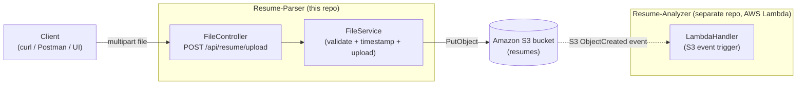

# Resume-Parser

A small Spring Boot REST service that accepts resume uploads (PDF/DOC/DOCX) and stores them in Amazon S3 — the **entry point** of a two-service AI resume-parsing pipeline. Once a file lands in S3, it triggers [Resume-Analyzer](https://github.com/Rezon669/Resume-Analyzer) (an AWS Lambda function) to extract structured candidate data via OpenAI.

> This repo only handles **upload and validation**. Text extraction, AI structuring, and persistence happen downstream in Resume-Analyzer — see that repo's README for the rest of the pipeline.

---

## ✨ Features

- **Single upload endpoint** — `POST /api/resume/upload`, multipart file upload.
- **File type validation** — only `.pdf`, `.doc`, `.docx` accepted; everything else is rejected with `415 Unsupported Media Type`.
- **Collision-safe S3 keys** — uploaded filenames are suffixed with a `dd-MM-yyyy-HH-mm-ss` timestamp before extension, so two resumes named `resume.pdf` uploaded seconds apart don't overwrite each other.
- **Structured logging** at each step (received, uploading, success/failure) for easy tracing in CloudWatch or local logs.

---

## 🏗️ Architecture — this service in the full pipeline



**Request flow (`POST /api/resume/upload`)**

1. `FileController` checks the file isn't empty and has an allowed extension (`.pdf`, `.doc`, `.docx`).
2. `FileService.uploadResume()` builds a collision-safe key (`originalName + timestamp + extension`) and pushes the file to S3 via `PutObjectRequest`.
3. From here, S3's `ObjectCreated` event notification (configured on the bucket, not in this codebase) is what triggers the Resume-Analyzer Lambda to actually parse and structure the resume — this service's job ends once the file is safely in S3.

---

## 🧰 Tech Stack

| Layer | Technology |
|---|---|
| Language / Runtime | Java 17 |
| Framework | Spring Boot 3.5.4 (Web) |
| Storage | Amazon S3 (via AWS SDK v2) |
| Build | Maven |

---

## 📡 API Reference

| Method | Path | Description |
|---|---|---|
| POST | `/api/resume/upload` | Multipart upload of a single resume file (`file` form field) |

**Example:**
```bash
curl -X POST http://localhost:8080/api/resume/upload \
  -F "file=@/path/to/resume.pdf"
```

**Responses:**
| Status | Condition |
|---|---|
| 200 OK | `"Resume uploaded successfully"` |
| 400 Bad Request | No file provided / empty file |
| 415 Unsupported Media Type | File extension isn't pdf/doc/docx |
| 500 Internal Server Error | S3 upload failed |

---

## ⚙️ Getting Started

### Prerequisites
- Java 17+
- Maven (or the included `./mvnw` wrapper)
- An AWS account with an S3 bucket, and IAM credentials with `s3:PutObject` permission on that bucket

### Configure
Set these in `src/main/resources/application.properties` (currently checked in with empty values — override via environment variables instead, see below):
```
aws.accessKey=${AWS_ACCESS_KEY_ID}
aws.secretKey=${AWS_SECRET_ACCESS_KEY}
aws.region=ap-south-1
aws.bucketName=${AWS_BUCKET_NAME}
```

### Run
```bash
./mvnw spring-boot:run
```
The app starts on `http://localhost:8080`.

---

## ⚠️ Known Limitations / Roadmap

- **Static AWS credentials via `@Value`** — `FileService` builds an explicit `StaticCredentialsProvider` from `application.properties` values. In any real AWS deployment (EC2, ECS, Lambda), prefer the SDK's **default credential provider chain** (IAM role) instead of long-lived access keys checked into config — remove the static-credentials block and just call `S3Client.builder().region(...).build()`.
- **`application.properties` currently commits empty `aws.accessKey`/`aws.secretKey` keys** — harmless as-is since they're blank, but it signals the intended pattern is env-var injected static keys rather than IAM roles; worth fixing alongside the point above.
- No authentication on the upload endpoint — anyone who can reach it can upload files to your bucket.
- No file size limit configured — consider adding `spring.servlet.multipart.max-file-size`/`max-request-size`.
- No automated tests beyond the default Spring Boot context load test.
- Planned: IAM-role-based S3 access, upload endpoint auth, file size limits, and a shared "pipeline" doc tying this repo together with Resume-Analyzer.

---

## 🔗 Related

- [Resume-Analyzer](https://github.com/Rezon669/Resume-Analyzer) — the AWS Lambda that's triggered once a file lands in S3, which extracts text (Apache Tika), structures it via OpenAI, and persists candidate/experience records to DynamoDB.

---

## 📄 License

MIT
